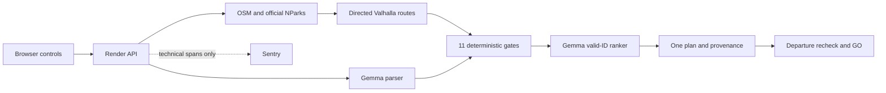

# Release architecture

The browser sends explicit controls and optional text to the Render API. Gemma parses additions into a bounded schema; explicit controls remain authoritative. OSM identifies candidates and the reviewed pedestrian gate. NParks supplies affirmative main-grounds admission and hours. SerpApi discovers official links; snippets cannot authorize a plan. Valhalla independently routes outbound and return legs.

Pure domain code validates budget, currency, complete duration, routing, return, opening hours, walking, exclusions, diet, grounding and price confidence. Gemma ranks only surviving plan IDs. The response contains one plan, proof and the effective return deadline. The browser validates the response contract again and checks freshness, opening interval and return deadline before GO.

Model transport is an authenticated temporary Cloudflare tunnel to a bounded localhost proxy on 11435, which calls the dedicated Ollama server on 11436. Raw Ollama is not published. The proxy permits tags/chat only, validates the exact model and limits concurrency, body size and generation. Gemma 4 `gemma4:e2b-it-qat` runs on the existing RTX 3050 laptop. This is a dependency on that laptop staying awake, connected and running; it is not durable hosting.

Source observations keep retrieval timestamps and field-specific expiry. Unknown hours, costs, exclusions or dietary facts do not become assertions. The accepted geographic scope is the Tanglin entrance corridor, main grounds only; paid attractions, food and parking are excluded. No worldwide acceptance or physical safety guarantee is claimed.

There are no accounts, booking/payment operations or persistent outing histories. Map providers receive coordinates needed for routing. Sentry receives allowlisted technical timings/status/trace identifiers, not exact GPS, prompts, request bodies or raw exceptions. Optional search/voice/tracing failures cannot change policy. The local fixture mode is development-only and production rejects fixture requests.
