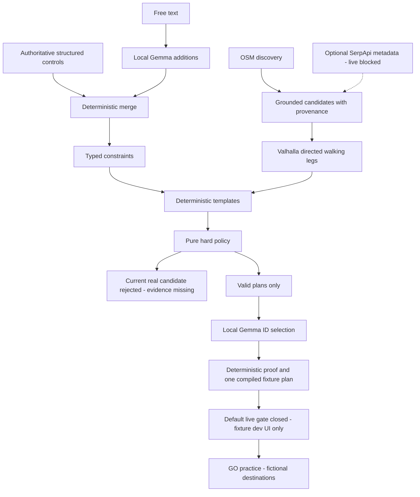

# I Stopped Asking AI Where to Go. I Made It Prove the Plan First.

Publication skeleton — unpublished. No real field outing or successful LIVE compiler
is claimed. A separate explicitly labelled fixture compiler is implemented. Replace future-work placeholders only after the gates pass.

## Opening

Constraints pile up: a spending cap, 90 minutes including the return, vegetarian
food, no mall, a place to talk. A fluent recommendation does not prove any of
those facts. Ground Rule's rule is: **LLMs interpret. Data grounds. Code verifies.**

## What currently works

Pure policy checks 11 hard categories. Local Gemma parses additions through a
deterministic control-preservation boundary. OSM returned 39 real Chennai POIs;
Valhalla supplied five directed walking legs. Deterministic templates assemble
candidate facts; the first real candidate failed evidence checks rather than
being promoted into a plan. Link phase reports, not a simulated success screen.

## Architecture diagram source

## Evaluation table to cite

| Observation | Evidence | Scope |
|---|---|---|
| 85/85 hard-policy cases | phase-2 report | synthetic policy, zero field outings |
| Gemma 3 4B: 72/100 raw exact; median 10135ms | phase-3 report | authored CPU benchmark |
| Gemma 4 E2B QAT: 82/100 raw exact; median 3488ms | phase-3 report | same matched request set |
| Gemma 4 final guards: 90/100 returned; zero control corruption | final replay-3 | offline guard replay of saved model output |
| 39 Chennai POIs, 3484.96ms | discovery live report | one provider request |
| 5/5 walking legs, 1948.04ms total | routing live report | provider ETA, not measured walking |
| 1 real candidate, 0 accepted | templates real-data report | honest price/hour/exclusion failure |

## Fixture architecture evidence

The post-Phase-7 sprint implements deterministic identity crosswalks, OSM interval
hours, enrichment freshness/conflicts, provider orchestration, valid-only Gemma
selection, deterministic proof and a gated API. The fixture HOME/result/GO labels
fictional observations throughout. Separate actual local ranker smokes are in
`compiler-gemma4-e2b-fixture-1.json` and `compiler-gemma3-4b-fixture-1.json`. They
prove wiring on one complete synthetic scenario, not real venue viability,
subjective ranking accuracy, global coverage or field outcomes.

## Preserved failure

Earlier unconstrained Gemma changed 50000 to 100000 minor units and invented a
departure date. The regression remains in the repository. Current finite
additions + deterministic guards preserve supplied controls, with model mistakes
reported separately from guard failures. Raw parsing accuracy is imperfect;
schema-valid JSON alone is not permission to display a plan.

## Real Plan Proof and field results — placeholders

Insert the first actual accepted plan and deterministic proof only after all
facts trace to sources. Then link three completed user field forms. Actual cost,
physical Time To Grass, screen ratio and unexpected outside failures remain blank.
No proof screenshot or outing video currently exists for a verified real plan.

## Open innovation / partners

Demonstrated: local Gemma, OpenStreetMap discovery, Valhalla development routing,
and a bounded cached component rejection. SerpApi adapter is offline-tested;
credential/identity linkage/live enrichment are blocked. Render/Sentry/ElevenLabs
were not integrated or demonstrated. No category claims for unused partners.
Fully offline accepted outing, global-city coverage and submission readiness
remain future gates. End with what actual field evidence taught us when available.
